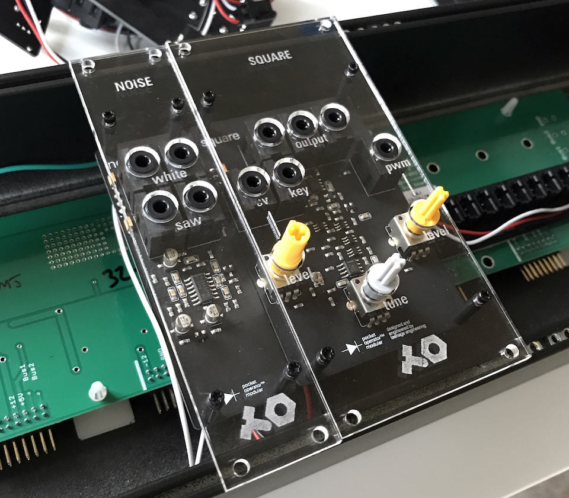
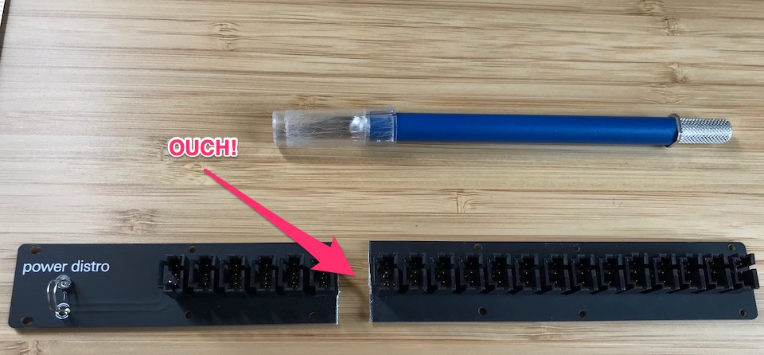
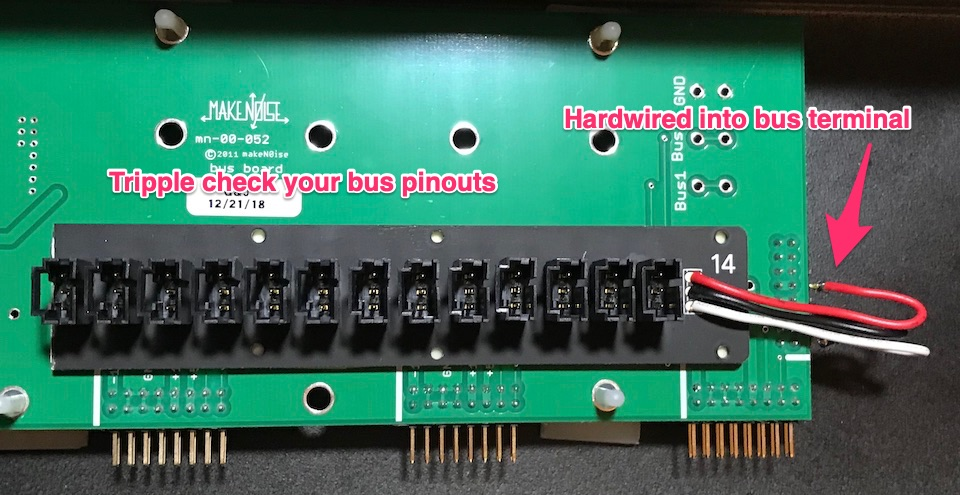

# Pocket Operator 400 to Eurorack Conversion

The PO 400 from [Teenage Engineering](https://teenage.engineering/products/po/modular) is Eurorack compatible! Unfortunately [these](https://teenage.engineering/_img/5c40d68837f9710004314dd3_original.pdf) are all the details we have so far.

#### Known:

+ PO operates in +12V / -12V Eurorack ranges
+ Modules on the PO 400 fit nicely in Eurorack standard sizes (with faceplates)

#### Unknown:

+ Do the CV ranges play nice with standard Eurorack modules?
+ How compatible are the stereo TRS jacks with most Eurorack modules?

#### Assumptions

I'm assuming 12v / -12v from a standard Eurorack PSU is compatible with the PO modules. Voltage is voltage is voltage (I suppose). Given these run off AAs, I'm assuming the amperage is low (maybe I'll measure them later). I'm also trying not to worry about the stereo to mono situation. I may be ordering a lot of conversion jacks soon.

_I have some full Eurorack modules on order so we will know soon how compatible things are. Let's hope I don't fry them!_

## WARNING ##

This conversion is all experimental. I have a limited electronics knowledge and may (probably) have made a mistake somewhere. Try this at your own risk! For those more knowledgable, please submit a bug report with any errors you find.

_Note to Teenage Engineering, please send a kind note to remove your branding if you feel the need. Big fan of your work, I will do so promptly. Also, thanks for the fun modules!_

## Conversion
Two differences need to be addressed before dropping your PO 400 modules into a standard Eurorack format system.

1. Power headers are not compatible
2. Modules are not mountable (too small, wrong hole spacing)

I've cheated on #1 (as you will see). For #2 I've uploaded my design files for laser cutting. These designs are based on the Teenage Engineering [details](https://teenage.engineering/_img/5c40d68837f9710004314dd3_original.pdf) and a lot of measuring. Initial test work great. I cut 3 mm acrylic and realized my Eurorack skiff machine screws are too short to bolt the modules down. Keep this in mind if you're not doing thin wood or metal faceplates.

#### Power Conversion

I hardwired a section of the PO 400 bus to my Eurorack power bus. The PO modules are pretty shallow, there is still room to place them in a Make Noise skiff with the bus added as shown.  

I wouldn't recommend cutting the bus as I did or hard wiring it to your Eurorack's bus. We should design a converter modules, pull requests are welcome!

